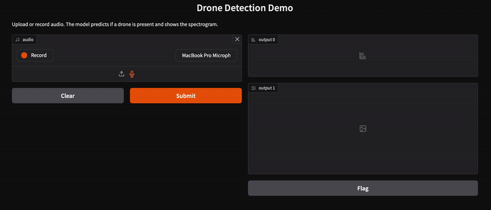

# Drone Sound Detection Model

This project implements a deep learning model for **drone sound detection** using spectrogram-based classification.  
It also provides a **Gradio dashboard with real-time spectrogram visualization**, allowing users to upload or record audio and see both predictions and the spectrogram.

## Approach

- **Dataset**: [Drone Audio Detection Samples](https://huggingface.co/datasets/geronimobasso/drone-audio-detection-samples) from Hugging Face  
- **Preprocessing**:   
  - **Normalize waveform amplitude**: I limited amplitudes to [-1,1] so that very loud or very quiet clips don’t dominate the training.  
  - **Pad/Crop to fixed duration (1s)**: I checked the lengths of the audio clips and most of them were under 1 second, so I fixed the duration to 1s for a consistent model input.  
  - **Convert to Mel-Spectrogram (128 bins)**: Converts 1D audio into a 2D time-frequency representation, capturing important spectral features.  
  - **Log scaling (dB) + per-sample normalization**: Log scaling reduces extreme differences between high and low amplitude signals; normalization ensures each sample has zero mean and unit variance for stable training.  
  - **Resize to 224x224 and expand to 3 channels**: I resized and duplicated the channels to match EfficientNet’s expected input, which is designed for 3-channel images.
 
- **Model**: EfficientNet-B0 with final classifier layer replaced to output 2 classes (Drone/No Drone).  
- **Loss/Optimizer**: CrossEntropyLoss + Adam optimizer  
- **Evaluation**: Accuracy, ROC curve, Precision-Recall curve (saved per epoch) 
- **Test**: Accuracy, Precision, Recall, F1-Score, Confusion Matrix

## Dependencies / Libraries

- Python 3.12
- torch==2.6.0
- torchaudio==2.6.0
- torchvision==0.21.0
- librosa==0.11.0
- numpy==1.26.0
- pandas==2.2.0
- scikit-learn==1.5.0
- matplotlib==3.10.6
- soundfile==0.13.1
- transformers==4.46.0
- gradio==5.48.0
- datasets==3.0.0


## Run training and evaluation
Run it with:
```bash
   python3 main.py
```   
This trains the **AudioEfficientNet** model and saves:
- **Final model weights**: `trained_model_weights.pth`
- **Evaluation plots per epoch**:  
  - ROC curves (`roc_epoch*.png`)  
  - Precision-Recall curves (`pr_epoch*.png`)
- **Misclassified samples for inspection**:  
  - Stored as `.wav` files in `misclassified/val_final/`

## Gradio Dashboard

**Gradio-based web app** allows you to:  
- Upload or record audio  
- See model predictions (Drone vs No Drone)  
- Visualize the spectrogram of the processed audio  

Run it with:
```bash
python3 app.py
``` 
The app will open in your browser at `http://localhost:7860`.



## ChatGPT/LLM Usage

During this project, I leveraged ChatGPT to accelerate and refine certain parts of the code and workflow. Specifically, ChatGPT helped with:

- **Initialization of the Gradio Interface**:  
  ChatGPT suggested the structure for the Gradio dashboard, including audio upload, microphone input, and outputs (label + spectrogram image). This helped speed up creating a functional and user-friendly UI.

- **Mel-Spectrogram Transformation**:  
  Guidance was provided on converting audio waveforms into mel-spectrograms, applying log scaling, and normalizing the features. This ensured the model input matched the format used during training.

- **Spectrogram Display & Scaling in Gradio**:  
  ChatGPT helped troubleshoot the bug I encountered when visualizing the spectrogram in Gradio. Specifically, it suggested min-max normalization and correct scaling to ensure the image values were in the range [-1, 1], which Gradio requires for float-type images.

